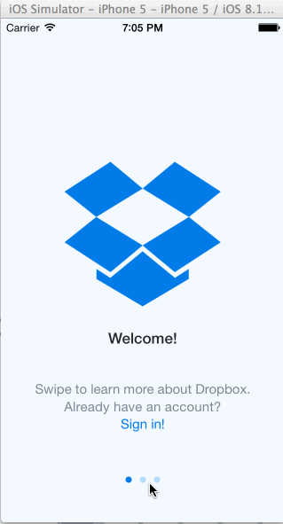

# dropbox
this is assignment for week #1

Time: I spent around 15-20 hours on the exercise

What does the app can do?

User can click through the Welcome screens and start the Sign up process from the last Welcome screen.
After creating an account, user will see the default screen for the app and tab through to the settings page. 
User can scroll up and down on the settings page and log out from there. 
After logout, user can choose to sign in again and see the default screen for the app.

The gif file is created with LICECap.
